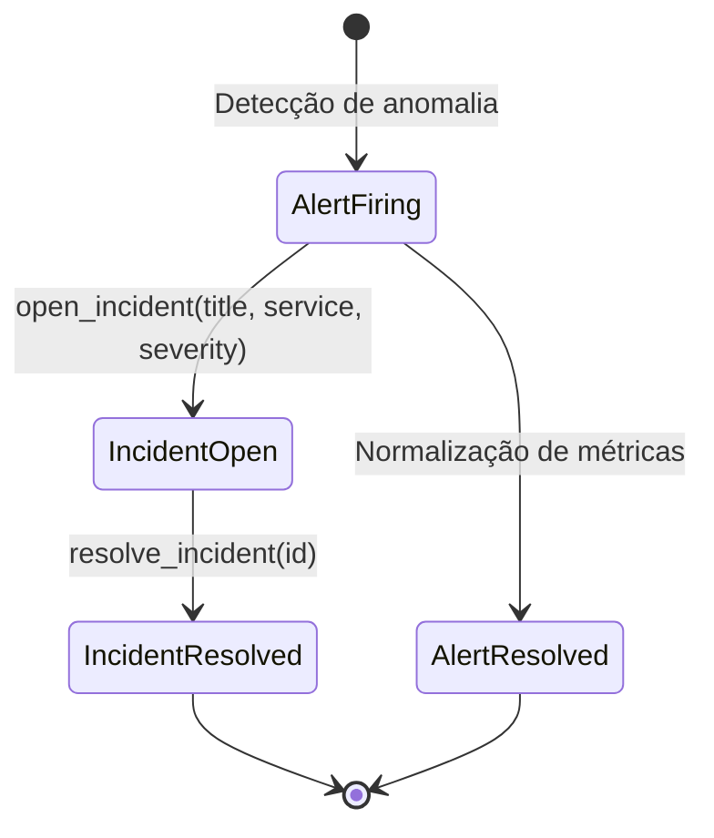
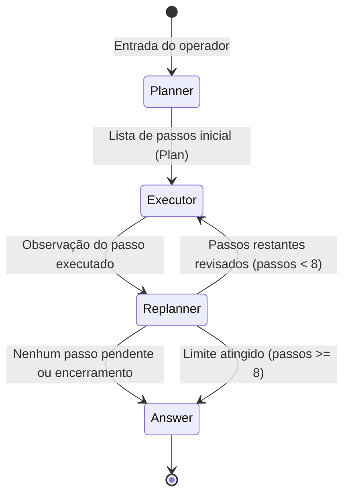

# Data Model: Núcleo de Raciocínio do OpsPilot

Este documento especifica os modelos de dados, schemas de validação Zod, entidades de domínio e transições de estado associadas ao núcleo de raciocínio da APO.

---

## 1. Entidades de Raciocínio e Auditoria

### 1.1 `TraceEvent`
Representa um passo discreto no processo cognitivo do agente durante a resolução de um incidente.

| Campo | Tipo | Descrição | Regras de Validação |
|---|---|---|---|
| `type` | `TraceEventType` | Categoria do evento | Enum estrito: `thought`, `action`, `observation`, `plan`, `critique`, `answer` |
| `content` | `string` | Texto descritivo ou síntese do passo | Não vazio |
| `tool` | `string` (opcional) | Nome da ferramenta invocada | Obrigatório quando `type === "action"` |
| `args` | `Record<string, unknown>` (opcional) | Argumentos passados à ferramenta | Presente quando `type === "action"` |
| `timestamp` | `string` (ISO 8601) | Momento da geração do evento | Gerado no runtime |

### 1.2 `ExecutionMetrics`
Registra o consumo de recursos e tempo da execução da estratégia.

| Campo | Tipo | Descrição | Validação |
|---|---|---|---|
| `llmCalls` | `number` | Total acumulado de chamadas à LLM | Inteiro `>= 0` |
| `latencyMs` | `number` | Tempo total decorrido em milissegundos | Número `>= 0` |

### 1.3 `StrategyResult`
Contrato de retorno de qualquer estratégia de raciocínio.

| Campo | Tipo | Descrição |
|---|---|---|
| `answer` | `string` | Resposta final sintetizada para o operador |
| `trace` | `TraceEvent[]` | Sequência cronológica completa de eventos |
| `metrics` | `ExecutionMetrics` | Métricas consolidadas da sessão |

---

## 2. Entidades Operacionais de Domínio

### 2.1 `Service`
Representa um serviço ou componente arquitetural monitorado pelo OpsPilot.

| Campo | Tipo | Descrição | Validação |
|---|---|---|---|
| `id` | `string` | Identificador único do serviço (ex.: `srv-auth`) | `z.string().min(1)` |
| `name` | `string` | Nome canônico do serviço | `z.string().min(1)` |
| `description` | `string?` | Descrição de responsabilidade do componente | Opcional |
| `tier` | `enum` | Criticidade de negócio | `tier-1`, `tier-2`, `tier-3` |

### 2.2 `Alert`
Representa uma anomalia ou notificação de observabilidade gerada por sistemas externos (ex.: Prometheus, Datadog).

| Campo | Tipo | Descrição | Validação |
|---|---|---|---|
| `id` | `string` | Identificador do alerta (ex.: `alt-001`) | `z.string().min(1)` |
| `service` | `string` | Nome do serviço afetado | Deve corresponder a um serviço válido |
| `title` | `string` | Descrição resumida do disparo do alerta | `z.string().min(1)` |
| `severity` | `enum` | Nível de severidade | `low`, `medium`, `high`, `critical` |
| `status` | `enum` | Estado atual do alerta | `firing`, `resolved` |
| `timestamp` | `string` (ISO 8601) | Data/hora do evento | ISO 8601 válido |

### 2.3 `Incident`
Representa a tratativa formal de um problema em produção associado a um ou mais alertas e serviços.

| Campo | Tipo | Descrição | Validação |
|---|---|---|---|
| `id` | `string` | Identificador único do incidente (ex.: `inc-kx82a-9f12`) | `z.string().min(1)` |
| `title` | `string` | Resumo executivo do incidente | `z.string().min(1)` |
| `service` | `string` | Serviço impactado | `z.string().min(1)` |
| `severity` | `enum` | Severidade operacional | `low`, `medium`, `high`, `critical` |
| `status` | `enum` | Ciclo de vida | `open`, `resolved` |
| `createdAt` | `string` (ISO 8601) | Timestamp de abertura | ISO 8601 válido |
| `updatedAt` | `string` (ISO 8601) | Timestamp da última atualização | ISO 8601 válido |

---

## 3. Diagrama de Transição de Estados

### Ciclo de Vida de Plan-and-Execute

