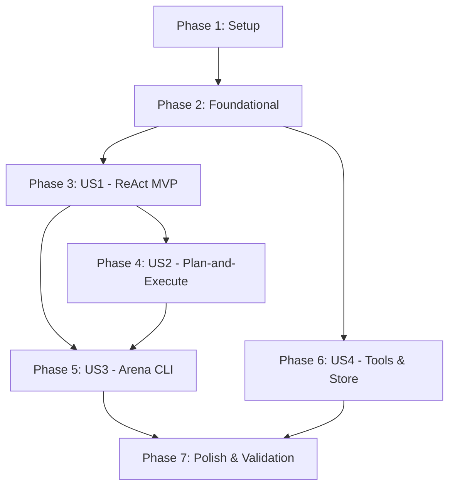

# Tasks: Núcleo de Raciocínio do OpsPilot

**Feature**: Núcleo de Raciocínio (ReAct, Plan-and-Execute, Tools, Store, Arena)  
**Branch**: `001-reasoning-core`  
**Input**: [spec.md](./spec.md), [plan.md](./plan.md), [data-model.md](./data-model.md), [contracts/](./contracts/)

---

## Phase 1: Setup (Shared Infrastructure)

**Purpose**: Estruturação inicial, dependências, schemas e tipagens fundamentais do projeto

- [x] T001 Criar estrutura de diretórios do núcleo de raciocínio em `src/agents/`, `src/schemas/`, `src/store/` e `src/scripts/`
- [x] T002 [P] Implementar schema de validação das variáveis de ambiente em `src/schemas/env.ts` (OPENROUTER_API_KEY, OPENROUTER_MODEL)
- [x] T003 [P] Implementar schemas Zod das entidades de domínio (Service, Alert, Incident, enums de status e severidade) em `src/schemas/entities.ts`

---

## Phase 2: Foundational (Blocking Prerequisites)

**Purpose**: Infraestrutura compartilhada mandatória antes da implementação das estratégias cognitivas

**⚠️ CRITICAL**: Nenhuma estratégia de raciocínio pode ser implementada antes da conclusão desta fase.

- [x] T004 Implementar contratos tipados de raciocínio (`ReasoningStrategy`, `TraceEvent`, `TraceEventType`, `ExecutionMetrics`, `StrategyResult`, `StrategyOptions`) em `src/agents/types.ts`
- [x] T005 Implementar fábrica centralizada de modelo de linguagem conectada ao OpenRouter (`temperature: 0`, baseURL e apiKey) em `src/agents/model.ts`
- [x] T006 Implementar store in-memory com seed primário (5 serviços e 6 alertas: 3 firing, 3 resolved) em `src/store/memory.ts`
- [x] T007 Implementar ferramentas operacionais padronizadas com Zod (`list_alerts`, `open_incident`, `resolve_incident`) em `src/agents/tools.ts`
- [x] T008 Implementar formatador e utilitários de trace e métricas (`formatTraceEvent`, `calculateMetrics`, `TraceCollector`) em `src/agents/trace.ts`

**Checkpoint**: Fundação completa — contratos, fábrica de modelo, store in-memory e ferramentas prontos para integração.

---

## Phase 3: User Story 1 - Raciocínio Operacional com ReAct e Rastreabilidade Completa (Priority: P1) 🎯 MVP

**Goal**: Permitir que a APO receba solicitações operacionais, execute o loop autônomo ReAct com tools via LangGraph e retorne resposta estruturada com trace tipado completo e métricas de consumo.

**Independent Test**: Instanciar `ReActStrategy`, invocar `run("Verifique alertas ativos do payment-gateway e abra um incidente se houver falha crítica")` com store mockado, verificando a emissão de eventos `thought`, `action`, `observation`, `answer` e métricas `llmCalls >= 1` e `latencyMs > 0`.

### Tests for User Story 1
- [x] T009 [P] [US1] Criar teste unitário determinístico de formatação e serialização de eventos de trace em `src/agents/trace.test.ts`
- [x] T010 [P] [US1] Criar teste unitário determinístico do interceptador de métricas (contagem de chamadas e latência) em `src/agents/metrics.test.ts`

### Implementation for User Story 1
- [x] T011 [US1] Implementar `ReActStrategy` utilizando `createReactAgent` do LangGraph em `src/agents/react.ts`
- [x] T012 [US1] Integrar o coletor de traces para converter `AIMessage` e `ToolMessage` em `TraceEvent` padronizados em `src/agents/react.ts`
- [x] T013 [US1] Integrar controle de limite máximo de iterações (`options.maxIterations`) e captura de métricas de LLM em `src/agents/react.ts`
- [x] T014 [US1] Implementar tratamento de erros e respostas estruturadas de fallback em `src/agents/react.ts`

**Checkpoint**: User Story 1 (MVP) 100% funcional e auditável de forma independente.

---

## Phase 4: User Story 2 - Planejamento e Execução Adaptativa (Plan-and-Execute) (Priority: P2)

**Goal**: Implementar a estratégia Plan-and-Execute como um grafo LangGraph com nós de `planner`, `executor` e `replanner`, decompondo problemas em passos sequenciais e respeitando o limite máximo de 8 passos.

**Independent Test**: Instanciar `PlanAndExecuteStrategy`, executar um plano sobre múltiplos alertas de um serviço, verificando se o grafo gera a lista de passos (`plan`), executa os passos através das ferramentas e encerra via replanner em no máximo 8 iterações.

### Tests for User Story 2
- [x] T015 [P] [US2] Criar teste unitário determinístico para validação da estrutura do plano e limites do router de execução em `src/agents/plan-and-execute.test.ts`

### Implementation for User Story 2
- [x] T016 [US2] Implementar nó `planner` com structured output Zod gerando lista sequencial de passos em `src/agents/plan-and-execute.ts`
- [x] T017 [US2] Implementar nó `executor` para processar cada passo pendente utilizando as tools operacionais em `src/agents/plan-and-execute.ts`
- [x] T018 [US2] Implementar nó `replanner` para reavaliar os passos restantes e decidir entre finalizar ou continuar em `src/agents/plan-and-execute.ts`
- [x] T019 [US2] Implementar lógica de roteamento do grafo com controle estrito de no máximo 8 passos em `src/agents/plan-and-execute.ts`
- [x] T020 [US2] Conectar captura completa de traces (`plan`, `action`, `observation`, `critique`, `answer`) e métricas em `src/agents/plan-and-execute.ts`

**Checkpoint**: Estratégia Plan-and-Execute autônoma e limitada a 8 passos testável independentemente.

---

## Phase 5: User Story 3 - Arena de Avaliação e Benchmark de Estratégias (Priority: P3)

**Goal**: Fornecer a CLI de Arena em `src/arena.ts` para executar uma ou mais estratégias em paralelo sobre o mesmo input de incidente, exibindo traces visuais e tabela comparativa de métricas.

**Independent Test**: Executar `npm run arena -- --strategies react,plan-and-execute --max-iterations 5`, validando a saída dos traces formatados de ambas as estratégias e a tabela final com chamadas LLM e latência.

### Implementation for User Story 3
- [x] T021 [US3] Implementar parsing de argumentos de linha de comando (`--strategies`, `--max-iterations`, `--prompt`) em `src/arena.ts`
- [x] T022 [US3] Implementar orquestrador de execução sequencial das estratégias selecionadas em `src/arena.ts`
- [x] T023 [US3] Implementar renderizador visual no terminal com coloração e formatação dos traces em `src/arena.ts`
- [x] T024 [US3] Implementar gerador tabular do sumário comparativo de métricas (LLM calls e latência) em `src/arena.ts`

**Checkpoint**: CLI da Arena totalmente operacional para avaliação e benchmarks comparativos.

---

## Phase 6: User Story 4 - Repositório de Estado Operacional e Ferramentas Seguras (Priority: P4)

**Goal**: Consolidar a suíte de ferramentas operacionais (`list_alerts`, `open_incident`, `resolve_incident`) e o store in-memory pré-populado com validação via Zod e testes unitários determinísticos.

**Independent Test**: Executar `npm test` validando que todos os métodos do store e ferramentas respondem com schemas validados e sem efeitos colaterais entre execuções.

### Tests for User Story 4
- [x] T025 [P] [US4] Criar testes unitários determinísticos do store in-memory e seed primário em `src/store/memory.test.ts`
- [x] T026 [P] [US4] Criar testes unitários determinísticos das ferramentas operacionais com validação Zod em `src/agents/tools.test.ts`

### Implementation for User Story 4
- [x] T027 [US4] Refinar validações de fronteira e tipagens de erros controlados nas tools em `src/agents/tools.ts`
- [x] T028 [US4] Assegurar isolamento do store in-memory com método `resetStore()` para suporte a testes idempotentes em `src/store/memory.ts`

**Checkpoint**: Estado operacional e ferramentas 100% testadas e blindadas contra entradas inválidas.

---

## Phase 7: Polish & Cross-Cutting Concerns

**Purpose**: Garantia de qualidade, validação end-to-end, conformidade de tipos e documentação

- [x] T029 [P] Executar checagem estática completa de tipos com `npm run typecheck` sem erros
- [x] T030 Executar suíte completa de testes determinísticos locais com `npm test` verificando tempo < 5s
- [x] T031 Executar validação prática do roteiro de execução contido em `specs/001-reasoning-core/quickstart.md`
- [x] T032 [P] Atualizar `README.md` com instruções de execução da Arena, seed primário e arquitetura de raciocínio da APO

---

## Dependencies & Execution Order

### Phase Dependencies

### Regras de Execução

1. **Setup (Fase 1) e Foundational (Fase 2)** devem ser finalizadas antes do início das estratégias cognitivas.
2. **US1 (ReAct)** é o **MVP**: sua entrega permite ter o primeiro agente funcional, rastreável e auditável.
3. **US2 (Plan-and-Execute)** constrói sobre as abstrações de `ReasoningStrategy` e ferramentas estabelecidas.
4. **US3 (Arena)** consome tanto `ReActStrategy` quanto `PlanAndExecuteStrategy`.
5. Todos os testes unitários (T009, T010, T015, T025, T026) são determinísticos e rodam sem conexão de rede.

---

## Parallel Opportunities

- **Fase 1**: `T002` (schemas env) e `T003` (schemas entities) podem ser executados em paralelo.
- **Fase 2**: `T004` (tipos), `T005` (model factory) e `T006` (store) operam em arquivos distintos e podem ser implementados em paralelo.
- **Fase 3**: `T009` (testes de trace) e `T010` (testes de métricas) podem ser desenvolvidos em paralelo antes de `T011`.
- **Fase 6**: `T025` (testes store) e `T026` (testes tools) rodam em paralelo.

---

## Implementation Strategy

### MVP First (Fases 1, 2 e 3)
1. Concluir Setup e Foundational.
2. Implementar ReActStrategy (`src/agents/react.ts`) e coletor de traces (`src/agents/trace.ts`).
3. Validar de forma independente com testes determinísticos.
4. **Checkpoint de entrega**: Primeiro incremento cognitivo do OpsPilot entregue e funcional.

### Incremental Delivery
1. Adicionar `PlanAndExecuteStrategy` (Fase 4) com teto de 8 passos.
2. Adicionar Arena CLI (Fase 5) para comparar ReAct e Plan-and-Execute lado a lado.
3. Rodar suíte completa de testes (`npm test`) e checagem de tipos (`npm run typecheck`).
