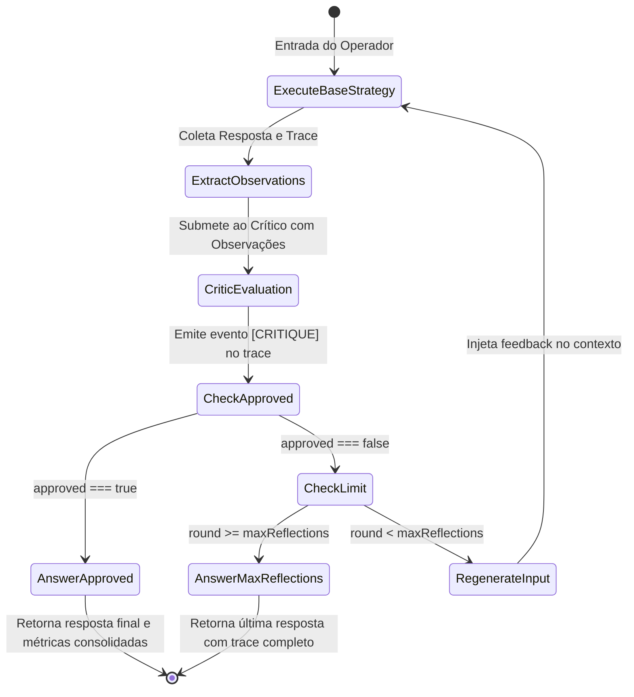

# Data Model: Camada Reflection

Este documento define os schemas de validação Zod, tipos de dados e diagramas de estado da camada de reflexão e auto-correção.

---

## 1. Schemas e Tipos de Dados

### 1.1 `CritiqueSchema`
Define o contrato de avaliação emitido pelo crítico do modelo.

```typescript
import { z } from "zod";

export const CritiqueSchema = z.object({
  approved: z.boolean().describe("true se a resposta atender aos fatos das observações; false se houver erros, omissões ou alucinações"),
  feedback: z.string().min(1).describe("Justificativa detalhada da aprovação ou instruções corretivas"),
});

export type CritiqueResult = z.infer<typeof CritiqueSchema>;
```

### 1.2 `ReflectionOptions`
Configurações opcionais passadas ao decorator `withReflection`.

```typescript
export interface ReflectionOptions {
  maxReflections?: number; // Padrão: 2
  model?: any; // Modelo customizado ou padrão do createModel()
}
```

### 1.3 `ReflectedStrategy`
Instância resultante de `withReflection(strategy, options)`.

| Propriedade | Tipo | Descrição |
|---|---|---|
| `name` | `string` | Prefixo `reflect:${baseStrategy.name}` |
| `run` | `(input: string, options?: StrategyOptions) => Promise<StrategyResult>` | Execução decorada com ciclo de crítica e regeneração |

---

## 2. Diagrama de Transições de Estado do Loop de Reflexão


