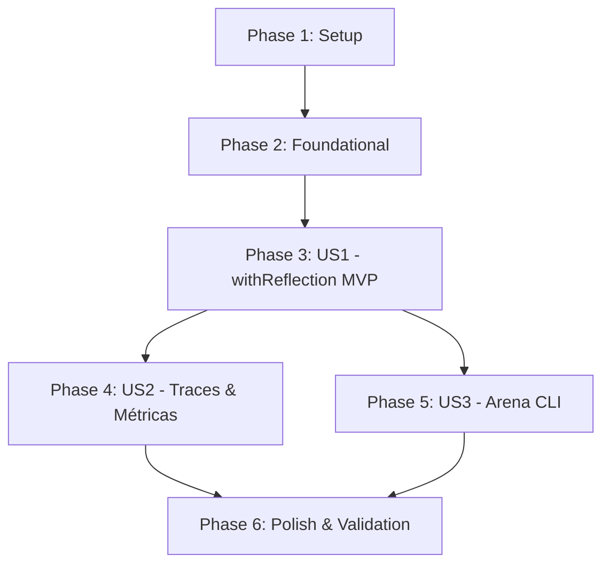

# Tasks: Camada Reflection para Estratégias de Raciocínio

**Feature**: Camada Reflection (`withReflection`, Crítico, Arena `reflect:*`)  
**Branch**: `002-reflection-layer`  
**Input**: [spec.md](./spec.md), [plan.md](./plan.md), [data-model.md](./data-model.md), [contracts/](./contracts/)

---

## Phase 1: Setup (Shared Infrastructure)

**Purpose**: Definição de tipos, contratos e schemas de validação da reflexão

- [X] T001 Exportar tipos `ReflectionOptions` e `CritiqueResult` em `src/agents/types.ts`
- [X] T002 [P] Definir `CritiqueSchema` Zod (`approved: boolean`, `feedback: string`) em `src/schemas/critique.ts`

---

## Phase 2: Foundational (Blocking Prerequisites)

**Purpose**: Implementação do avaliador crítico com structured output e fallback resiliente

**⚠️ CRITICAL**: A função de avaliação do crítico deve estar pronta antes da montagem do decorator.

- [X] T003 Implementar avaliador crítico `evaluateAnswer(input, answer, observations, options)` usando `createModel()` e parser resiliente em `src/agents/reflection.ts`

**Checkpoint**: Crítico operacional — pronto para ser acoplado ao loop de reflexão.

---

## Phase 3: User Story 1 - Auto-avaliação Crítica e Regeneração de Respostas (Priority: P1) 🎯 MVP

**Goal**: Implementar a função de ordem superior `withReflection` que envolve qualquer `ReasoningStrategy`, submete a resposta ao crítico e regenera sob feedback corretivo respeitando `maxReflections` (default 2).

**Independent Test**: Instanciar uma estratégia com mock, decorada com `withReflection`. Na 1ª rodada simular resposta incompleta; validar que o crítico reprova, uma 2ª rodada é executada com o feedback no contexto e a resposta aprovada é entregue com sucesso.

### Tests for User Story 1
- [X] T004 [P] [US1] Criar testes unitários determinísticos cobrindo aprovação direta e regeneração de resposta sob feedback em `src/agents/reflection.test.ts`

### Implementation for User Story 1
- [X] T005 [US1] Implementar o decorator `withReflection(strategy, options)` retornando nova `ReasoningStrategy` com nome `reflect:${strategy.name}` em `src/agents/reflection.ts`
- [X] T006 [US1] Implementar a injeção do feedback corretivo no contexto de entrada das rodadas subsequentes em `src/agents/reflection.ts`
- [X] T007 [US1] Implementar controle estrito de parada quando `approved === true` ou quando atingir `maxReflections` em `src/agents/reflection.ts`

**Checkpoint**: User Story 1 (MVP) 100% funcional e testável de forma independente.

---

## Phase 4: User Story 2 - Rastreabilidade e Auditoria de Eventos de Crítica (Priority: P2)

**Goal**: Garantir que cada avaliação crítica seja registrada como evento do tipo `critique` no trace consolidado e que as métricas somem chamadas e latência.

**Independent Test**: Executar uma estratégia refletida que passe por reprovação e validar que o trace contém eventos `type: "critique"` e que `metrics.llmCalls` contabiliza as chamadas da base + chamadas do crítico.

### Tests for User Story 2
- [X] T008 [P] [US2] Criar teste unitário determinístico verificando a emissão de eventos `critique` e a agregação cumulativa de métricas em `src/agents/reflection.test.ts`

### Implementation for User Story 2
- [X] T009 [US2] Integrar acúmulo cronológico de eventos da base intercalados com eventos `critique` em `src/agents/reflection.ts`
- [X] T010 [US2] Implementar soma acumulativa de `llmCalls` e cálculo de `latencyMs` total no resultado em `src/agents/reflection.ts`

**Checkpoint**: Trilha de raciocínio auditável e métricas cumulativas validadas.

---

## Phase 5: User Story 3 - Comparação de Estratégias Refletidas na Arena (Priority: P3)

**Goal**: Registrar as estratégias `reflect:react` e `reflect:plan-and-execute` na CLI da Arena (`src/arena.ts`), suportando comparativos diretos e aliases amigáveis.

**Independent Test**: Executar `npm run arena -- --strategies react,reflect:react --max-iterations 4`, conferindo a execução sequencial e o sumário comparativo no terminal.

### Implementation for User Story 3
- [X] T011 [US3] Registrar instâncias `reflect:react` e `reflect:plan-and-execute` em `src/arena.ts`
- [X] T012 [US3] Adicionar aliases amigáveis (`reflect-react`, `reflect:plan-execute`, `reflect-plan-and-execute`) e atualizar o texto de `--help` em `src/arena.ts`

**Checkpoint**: Arena CLI capacitada a rodar estratégias base e refletidas lado a lado.

---

## Phase 6: Polish & Cross-Cutting Concerns

**Purpose**: Garantia de qualidade, conformidade de tipos, validação de roteiro e documentação

- [X] T013 [P] Executar checagem estática completa de tipos com `npm run typecheck` sem erros
- [X] T014 Executar suíte completa de testes determinísticos locais com `npm test` verificando tempo < 3s
- [X] T015 Executar validação prática do roteiro contido em `specs/002-reflection-layer/quickstart.md`
- [X] T016 [P] Atualizar `README.md` com a documentação da camada Reflection e exemplos de uso na Arena

---

## Dependencies & Execution Order

### Phase Dependencies

### Regras de Execução

1. **Setup (Fase 1) e Foundational (Fase 2)** devem ser concluídas antes da implementação do decorator.
2. **US1** entrega o núcleo funcional da reflexão (MVP).
3. **US2** consolida a observabilidade e auditoria exigidas pela constituição.
4. **US3** conecta as variantes refletidas à CLI da Arena.
5. Todos os testes unitários (T004, T008) são determinísticos e rodam sem dependência de rede.

---

## Parallel Opportunities

- **Fase 1**: `T001` (tipos) e `T002` (schemas) rodam em paralelo.
- **Fase 3**: `T004` (testes de US1) é escrito antes ou em paralelo à implementação de `T005`.
- **Fase 4**: `T008` (testes de métricas e trace) pode ser preparado em paralelo a `T009`.
- **Fase 6**: `T013` (typecheck) e `T016` (README) podem ser executados em paralelo.

---

## Implementation Strategy

### MVP First (Fases 1, 2 e 3)
1. Concluir Setup e o avaliador crítico.
2. Implementar `withReflection` com parada por `approved` e `maxReflections`.
3. Validar de forma independente com testes determinísticos.
4. **Checkpoint de entrega**: Primeiro decorator cognitivo do OpsPilot entregue e funcional.

### Incremental Delivery
1. Refinar agregação de traces e métricas (Fase 4).
2. Adicionar `reflect:react` e `reflect:plan-and-execute` na Arena (Fase 5).
3. Validar suíte completa com `npm test` e `npm run typecheck` (Fase 6).
