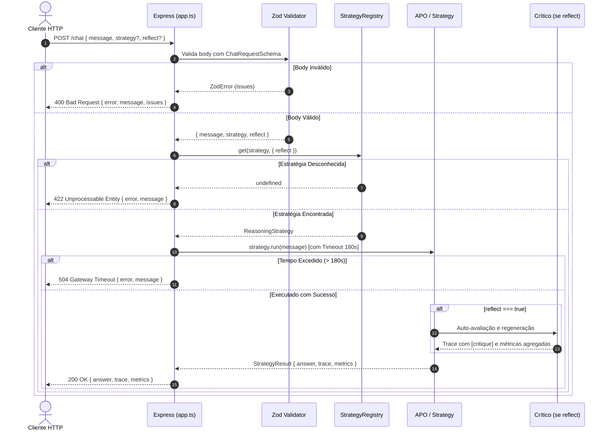

# Data Model: API HTTP de Chat Operacional

Este documento detalha os modelos de dados, schemas Zod e o ciclo de vida das requisições tratadas pelo endpoint `POST /chat`.

---

## 1. Schemas e Tipos de Dados

### 1.1 `ChatRequestSchema`
Valida o corpo JSON submetido ao endpoint `POST /chat`.

```typescript
import { z } from "zod";

export const ChatRequestSchema = z.object({
  message: z
    .string({
      required_error: "O campo 'message' é obrigatório",
      invalid_type_error: "O campo 'message' deve ser uma string",
    })
    .trim()
    .min(1, "O campo 'message' não pode ser vazio"),
  strategy: z
    .string({
      invalid_type_error: "O campo 'strategy' deve ser uma string",
    })
    .trim()
    .default("react"),
  reflect: z
    .boolean({
      invalid_type_error: "O campo 'reflect' deve ser um booleano",
    })
    .default(false),
});

export type ChatRequest = z.infer<typeof ChatRequestSchema>;
```

---

### 1.2 `ChatResponseSchema`
Define a resposta de sucesso com status `200 OK`.

```typescript
import { z } from "zod";

export const TraceEventSchema = z.object({
  type: z.enum(["thought", "action", "observation", "plan", "critique", "answer"]),
  content: z.string(),
  tool: z.string().optional(),
  args: z.record(z.unknown()).optional(),
  timestamp: z.string().optional(),
});

export const ExecutionMetricsSchema = z.object({
  llmCalls: z.number().int().nonnegative(),
  latencyMs: z.number().int().nonnegative(),
});

export const ChatResponseSchema = z.object({
  answer: z.string(),
  trace: z.array(TraceEventSchema),
  metrics: ExecutionMetricsSchema,
});

export type ChatResponse = z.infer<typeof ChatResponseSchema>;
```

---

### 1.3 `ErrorResponseSchema`
Define o formato padronizado de erro retornado pela API para códigos `400`, `422`, `504` e `500`.

```typescript
export const ErrorResponseSchema = z.object({
  error: z.string(),
  message: z.string(),
  details: z.unknown().optional(),
  issues: z.array(z.record(z.unknown())).optional(),
});

export type ErrorResponse = z.infer<typeof ErrorResponseSchema>;
```

---

## 2. Diagrama de Fluxo e Estados da Requisição


