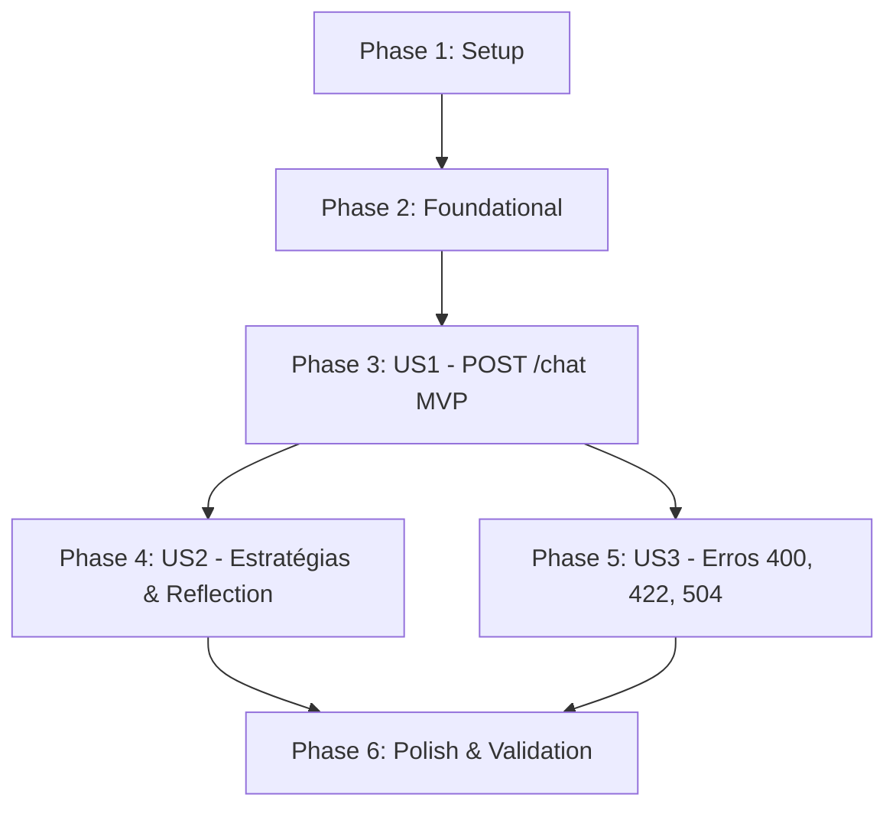

# Tasks: API HTTP para Interação de Chat Operacional (`POST /chat`)

**Feature**: Endpoint HTTP `POST /chat`, Catálogo de Estratégias e Validação na Fronteira  
**Branch**: `003-http-chat-api`  
**Input**: [spec.md](./spec.md), [plan.md](./plan.md), [data-model.md](./data-model.md), [contracts/](./contracts/)

---

## Phase 1: Setup (Shared Infrastructure)

**Purpose**: Definição de schemas de entrada e saída com Zod e utilitários de teste determinísticos

- [X] T001 [P] Definir schemas Zod `ChatRequestSchema`, `ChatResponseSchema` e `ErrorResponseSchema` em `src/schemas/chat.ts`
- [X] T002 [P] Implementar classe auxiliar `FakeReasoningStrategy` para testes determinísticos sem rede em `src/http/fake-strategy.ts`

---

## Phase 2: Foundational (Blocking Prerequisites)

**Purpose**: Catálogo central de estratégias (`StrategyRegistry`) e estrutura base do Express v5

**⚠️ CRITICAL**: O catálogo de estratégias e a fábrica do app Express devem estar prontos antes da implementação dos endpoints.

- [X] T003 Implementar catálogo `StrategyRegistry` em `src/agents/index.ts` suportando `react`, `plan-and-execute`, registro dinâmico e aplicação de `withReflection`
- [X] T004 Implementar fábrica de aplicação Express `createApp({ registry, timeoutMs })` com middlewares padrão em `src/http/app.ts`

**Checkpoint**: Infraestrutura pronta — criação e testes de rotas podem começar.

---

## Phase 3: User Story 1 - Consulta Operacional Padrão via Chat HTTP (Priority: P1) 🎯 MVP

**Goal**: Rota `POST /chat` operacional respondendo com `200 OK` (`{ answer, trace, metrics }`), selecionando por padrão a estratégia `react`.

**Independent Test**: Enviar requisição HTTP `POST /chat` com `{"message": "Verifique os alertas"}` contra o servidor de teste com estratégia fake; validar status `200 OK` e JSON com `answer`, `trace` e `metrics`.

### Tests for User Story 1
- [X] T005 [P] [US1] Criar teste de integração para o fluxo de sucesso `POST /chat` com estratégia padrão em `src/http/server.test.ts`

### Implementation for User Story 1
- [X] T006 [US1] Implementar handler da rota `POST /chat` em `src/http/app.ts` resolvendo a estratégia padrão e retornando `{ answer, trace, metrics }`
- [X] T007 [US1] Implementar bootstrap do servidor HTTP com `app.listen()` na porta de ambiente (`PORT`) em `src/http/server.ts`

**Checkpoint**: User Story 1 (MVP) 100% funcional e testável de forma independente.

---

## Phase 4: User Story 2 - Seleção de Estratégia de Raciocínio e Ativação de Reflection (Priority: P2)

**Goal**: Permitir ao cliente especificar a estratégia de raciocínio no corpo da requisição (`strategy`) e ativar a camada de auto-avaliação crítica (`reflect: true`).

**Independent Test**: Enviar requisição com `{"message": "teste", "strategy": "plan-and-execute", "reflect": true}` e validar que a estratégia executada recebe a reflexão e inclui eventos de crítica no trace.

### Tests for User Story 2
- [X] T008 [P] [US2] Criar testes de integração para seleção de estratégia alternativa e ativação de reflexão (`reflect: true`) em `src/http/server.test.ts`

### Implementation for User Story 2
- [X] T009 [US2] Conectar parâmetros `strategy` e `reflect` ao `StrategyRegistry` no controller da rota `POST /chat` em `src/http/app.ts`

**Checkpoint**: Seleção dinâmica de estratégias e reflexão ativada sob demanda via HTTP.

---

## Phase 5: User Story 3 - Resiliência, Validação Estrita na Fronteira e Controle de Timeout (Priority: P3)

**Goal**: Garantir tratamento robusto de erros retornando `400 Bad Request` para corpo inválido, `422 Unprocessable Entity` para estratégias desconhecidas e `504 Gateway Timeout` para execuções que ultrapassem 180s.

**Independent Test**:
- Enviar corpo inválido e validar `400 Bad Request` com lista de issues do Zod.
- Enviar estratégia inexistente e validar `422 Unprocessable Entity` com catálogo de disponíveis.
- Simular operação que excede o timeout configurado e validar `504 Gateway Timeout`.

### Tests for User Story 3
- [X] T010 [P] [US3] Criar testes de integração cobrindo os cenários de erro HTTP `400`, `422` e `504` em `src/http/server.test.ts`

### Implementation for User Story 3
- [X] T011 [US3] Adicionar validação com `ChatRequestSchema` retornando `400 Bad Request` estruturado em `src/http/app.ts`
- [X] T012 [US3] Adicionar verificação de estratégia inexistente no `StrategyRegistry` retornando `422 Unprocessable Entity` em `src/http/app.ts`
- [X] T013 [US3] Implementar controle de timeout de 180s (configurável) com retorno `504 Gateway Timeout` em `src/http/app.ts`

**Checkpoint**: Todas as fronteiras de erro e timeouts protegidos e validados.

---

## Phase 6: Polish & Cross-Cutting Concerns

**Purpose**: Conformidade estática, validação de roteiro prático e documentação

- [X] T014 [P] Executar checagem estática completa de tipos com `npm run typecheck` sem erros
- [X] T015 Executar suíte completa de testes locais com `npm test` verificando tempo < 3s
- [X] T016 Executar validação prática do roteiro contido em `specs/003-http-chat-api/quickstart.md`
- [X] T017 [P] Atualizar `README.md` com a documentação do endpoint `POST /chat` e exemplos práticos com `curl`

---

## Dependencies & Execution Order

### Phase Dependencies

### Regras de Execução

1. **Setup (Fase 1) e Foundational (Fase 2)** são pré-requisitos bloqueantes para todas as user stories.
2. **US1** entrega o núcleo da API HTTP (MVP).
3. **US2** habilita as opções avançadas de estratégia e reflexão.
4. **US3** consolida a resiliência operacional e governança de erros da constituição.
5. Todos os testes de integração em `src/http/server.test.ts` rodam sem dependência de rede ou LLM externa.

---

## Parallel Opportunities

- **Fase 1**: `T001` (schemas Zod) e `T002` (fake strategy) podem ser implementados em paralelo.
- **Fase 3**: `T005` (teste de US1) é escrito antes ou em paralelo à implementação de `T006`.
- **Fase 4**: `T008` (teste de US2) pode ser escrito em paralelo a `T009`.
- **Fase 5**: `T010` (teste de US3) pode ser escrito em paralelo a `T011`, `T012` e `T013`.
- **Fase 6**: `T014` (typecheck) e `T017` (README) rodam em paralelo.

---

## Implementation Strategy

### MVP First (Fases 1, 2 e 3)
1. Concluir Setup (schemas e fake strategy).
2. Concluir Foundational (`StrategyRegistry` e `createApp`).
3. Implementar handler `POST /chat` e servidor base.
4. Validar via teste de integração `T005`.
5. **Checkpoint de entrega**: Primeiro endpoint HTTP operacional do OpsPilot no ar.

### Incremental Delivery
1. Adicionar suporte a parâmetros de estratégia e reflexão (Fase 4).
2. Implementar validação estrita, erros 422 e proteção por timeout 504 (Fase 5).
3. Validar suíte completa com `npm test` e `npm run typecheck` (Fase 6).
