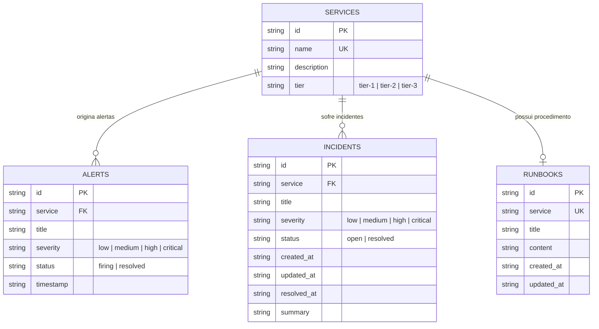
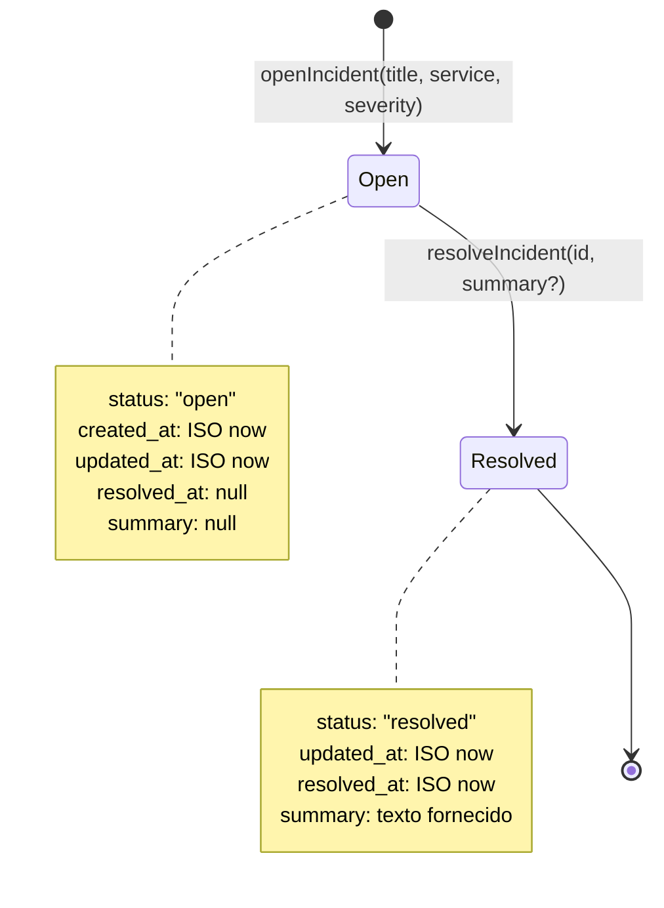

# Data Model: Persistência Relacional com SQLite (`004-sqlite-ops-persistence`)

**Feature**: `004-sqlite-ops-persistence`
**Date**: 2026-09-20
**Status**: Completed

## 1. Esquema Relacional DDL (SQLite)

O banco é criado com inicialização DDL idempotente no construtor do `SqliteOpsStore`:

```sql
CREATE TABLE IF NOT EXISTS services (
  id TEXT PRIMARY KEY,
  name TEXT NOT NULL UNIQUE,
  description TEXT,
  tier TEXT NOT NULL CHECK (tier IN ('tier-1', 'tier-2', 'tier-3'))
);

CREATE TABLE IF NOT EXISTS alerts (
  id TEXT PRIMARY KEY,
  service TEXT NOT NULL,
  title TEXT NOT NULL,
  severity TEXT NOT NULL CHECK (severity IN ('low', 'medium', 'high', 'critical')),
  status TEXT NOT NULL CHECK (status IN ('firing', 'resolved')),
  timestamp TEXT NOT NULL
);

CREATE TABLE IF NOT EXISTS incidents (
  id TEXT PRIMARY KEY,
  title TEXT NOT NULL,
  service TEXT NOT NULL,
  severity TEXT NOT NULL CHECK (severity IN ('low', 'medium', 'high', 'critical')),
  status TEXT NOT NULL CHECK (status IN ('open', 'resolved')),
  created_at TEXT NOT NULL,
  updated_at TEXT NOT NULL,
  resolved_at TEXT,
  summary TEXT
);

CREATE TABLE IF NOT EXISTS runbooks (
  id TEXT PRIMARY KEY,
  service TEXT NOT NULL UNIQUE,
  title TEXT NOT NULL,
  content TEXT NOT NULL,
  created_at TEXT NOT NULL,
  updated_at TEXT NOT NULL
);
```

---

## 2. Modelos de Entidade e Schemas Zod (`src/schemas/entities.ts`)

### `Service`
- `id`: string (não vazia)
- `name`: string (não vazia, único)
- `description`: string (opcional)
- `tier`: enum (`"tier-1" | "tier-2" | "tier-3"`), default `"tier-2"`

### `Alert`
- `id`: string (não vazia)
- `service`: string (não vazia)
- `title`: string (não vazia)
- `severity`: enum (`"low" | "medium" | "high" | "critical"`)
- `status`: enum (`"firing" | "resolved"`)
- `timestamp`: string ISO 8601

### `Incident`
- `id`: string (não vazia)
- `title`: string (não vazia)
- `service`: string (não vazia)
- `severity`: enum (`"low" | "medium" | "high" | "critical"`)
- `status`: enum (`"open" | "resolved"`)
- `createdAt`: string ISO 8601
- `updatedAt`: string ISO 8601
- `resolvedAt`: string ISO 8601 (opcional / anulável)
- `summary`: string (opcional / anulável)

### `Runbook`
- `id`: string (não vazia)
- `service`: string (não vazia, único)
- `title`: string (não vazia)
- `content`: string (conteúdo formatado em Markdown com diagnósticos e ações)
- `createdAt`: string ISO 8601
- `updatedAt`: string ISO 8601

---

## 3. Diagrama de Relacionamento de Entidades



---

## 4. Ciclo de Vida e Transições de Estado

### Ciclo do Incidente (`Incident`):



---

## 5. Mapeamento Bidirecional (Banco ↔ Domínio)

As tabelas utilizam a convenção relacional padrão `snake_case` e o domínio TypeScript utiliza a convenção `camelCase`:

| Coluna SQLite | Campo Domínio TypeScript | Observação |
|---|---|---|
| `created_at` | `createdAt` | Serializado em formato ISO 8601 |
| `updated_at` | `updatedAt` | Atualizado a cada mutação |
| `resolved_at` | `resolvedAt` | `null` quando aberto; ISO 8601 quando resolvido |
| `summary` | `summary` | `null` quando aberto; texto livre quando resolvido |
