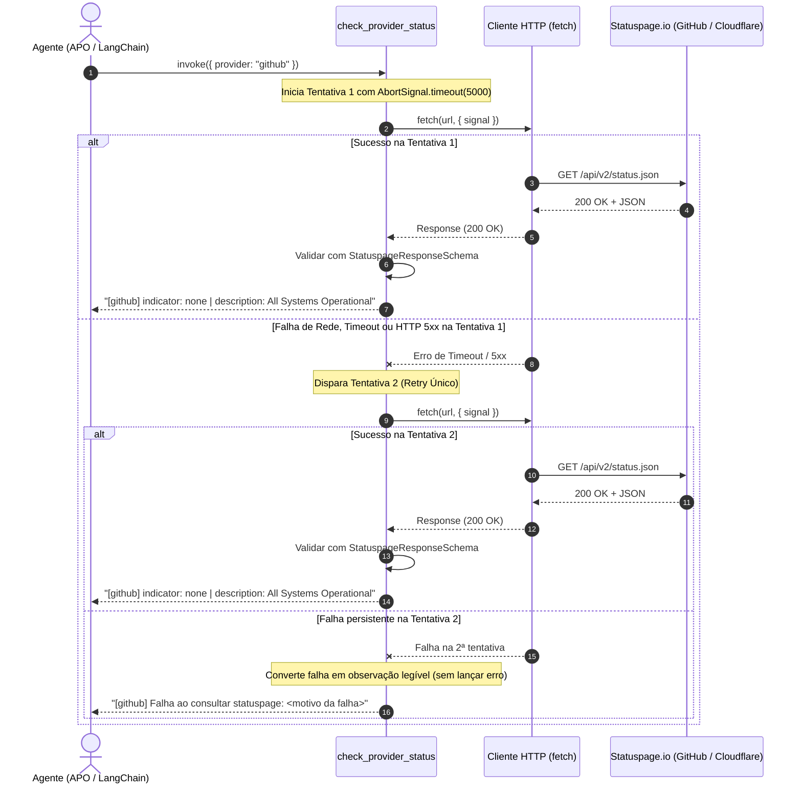

# Data Model & Schemas: Ferramenta de Status de Provedores Externos

**Feature**: `005-provider-status-tool`  
**Date**: 2026-09-20  
**Status**: Completed  

## 1. Schemas Zod de Validação na Fronteira

### Schema de Entrada da Ferramenta (`ProviderStatusInputSchema`)

```typescript
import { z } from "zod";

export const ProviderEnumSchema = z.enum(["github", "cloudflare"]);
export type ProviderEnum = z.infer<typeof ProviderEnumSchema>;

export const ProviderStatusInputSchema = z.object({
  provider: ProviderEnumSchema.default("github").describe(
    "Identificador do provedor externo a consultar: 'github' ou 'cloudflare'. Padrão: 'github'."
  ),
});
export type ProviderStatusInput = z.infer<typeof ProviderStatusInputSchema>;
```

### Schema de Validação da Resposta da Statuspage (`StatuspageResponseSchema`)

```typescript
export const StatuspageResponseSchema = z.object({
  status: z.object({
    indicator: z.string().describe("Indicador operacional do provedor: 'none', 'minor', 'major', 'critical'"),
    description: z.string().describe("Descrição textual do estado atual dos serviços do provedor"),
  }),
});
export type StatuspageResponse = z.infer<typeof StatuspageResponseSchema>;
```

---

## 2. Catálogo e Configuração dos Provedores

```typescript
export const PROVIDER_ENDPOINTS: Record<ProviderEnum, string> = {
  github: "https://www.githubstatus.com/api/v2/status.json",
  cloudflare: "https://www.cloudflarestatus.com/api/v2/status.json",
};
```

---

## 3. Diagrama de Sequência e Fluxo de Resiliência


