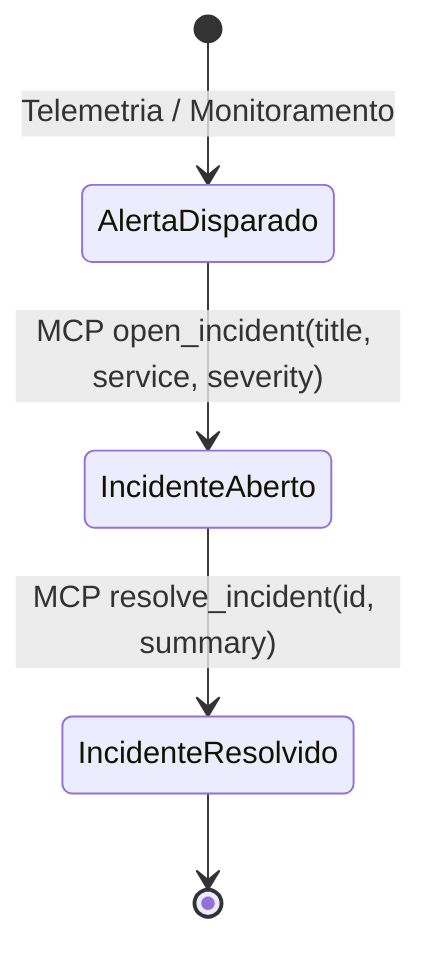

# Data Model: Servidor MCP do OpsPilot (`006-mcp-server`)

**Feature**: Exposição de Ferramentas Operacionais via Model Context Protocol (MCP)  
**Date**: 2026-09-21  
**Status**: Completed  

---

## 1. Esquemas Zod Compartilhados de Entrada de Ferramentas

Os esquemas a seguir representam a **única fonte de verdade** para parâmetros de entrada, utilizados indistintamente pelas ferramentas LangChain e pelo servidor MCP:

### 1.1 `ListAlertsInputSchema`
```typescript
export const ListAlertsInputSchema = z.object({
  status: z
    .enum(["firing", "resolved", "all"])
    .default("firing")
    .describe(
      "Filtro do estado do alerta: 'firing' para alertas ativos no plantão, 'resolved' para alertas normalizados, ou 'all' para todos."
    ),
});
export type ListAlertsInput = z.infer<typeof ListAlertsInputSchema>;
```

### 1.2 `OpenIncidentInputSchema`
```typescript
export const OpenIncidentInputSchema = z.object({
  title: z
    .string()
    .min(1)
    .describe("Título descritivo e conciso do incidente operacional."),
  service: z
    .string()
    .min(1)
    .describe(
      "Identificador do serviço impactado (ex.: 'payment-gateway', 'auth-service', 'order-api')."
    ),
  severity: z
    .enum(["low", "medium", "high", "critical"])
    .describe(
      "Nível de severidade operacional do incidente ('low', 'medium', 'high', 'critical')."
    ),
});
export type OpenIncidentInput = z.infer<typeof OpenIncidentInputSchema>;
```

### 1.3 `ResolveIncidentInputSchema`
```typescript
export const ResolveIncidentInputSchema = z.object({
  id: z
    .string()
    .min(1)
    .describe("Identificador único do incidente a ser encerrado (ex.: 'inc-xxx')."),
  summary: z
    .string()
    .optional()
    .describe(
      "Resumo ou justificativa opcional descrevendo a ação corretiva aplicada para mitigação."
    ),
});
export type ResolveIncidentInput = z.infer<typeof ResolveIncidentInputSchema>;
```

---

## 2. Estrutura de Retorno das Ferramentas MCP

De acordo com a especificação MCP (`@modelcontextprotocol/sdk`), todo retorno de invocação de ferramenta (`call_tool`) deve produzir um objeto de resultado contendo uma lista de blocos de conteúdo textual ou dados estruturados:

```typescript
export interface McpToolResult {
  content: Array<{
    type: "text";
    text: string;
  }>;
  isError?: boolean;
}
```

### Exemplos de Conteúdo Retornado:

1. **`list_alerts`**:
   - `content[0].text`: Array JSON serializado contendo os alertas filtrados da loja de dados (`store.listAlerts(status)`).
2. **`open_incident`**:
   - `content[0].text`: Objeto JSON do incidente recém-criado com identificador `inc-xxx`, timestamps e status `open`.
3. **`resolve_incident`**:
   - `content[0].text`: Objeto JSON do incidente atualizado com status `resolved` e `resolvedAt`. Em caso de ID inexistente, retorna mensagem amigável com `isError: true` ou texto explicativo de erro.

---

## 3. Mapeamento de Entidades no `OpsStore`

As operações despachadas pelo servidor MCP interagem diretamente com as entidades de domínio já persistidas no SQLite ou na memória:

| Entidade | Campos Principais | Ações Via MCP |
|---|---|---|
| **Alert** | `id`, `service`, `title`, `severity`, `status`, `timestamp` | Leitura filtrada via `list_alerts` |
| **Incident** | `id`, `title`, `service`, `severity`, `status`, `createdAt`, `resolvedAt`, `summary` | Criação via `open_incident`, Atualização via `resolve_incident` |
| **Service** | `id`, `name`, `tier`, `description` | Validado como chave estrangeira/referência de serviço nos incidentes |

---

## 4. Transições de Estado


