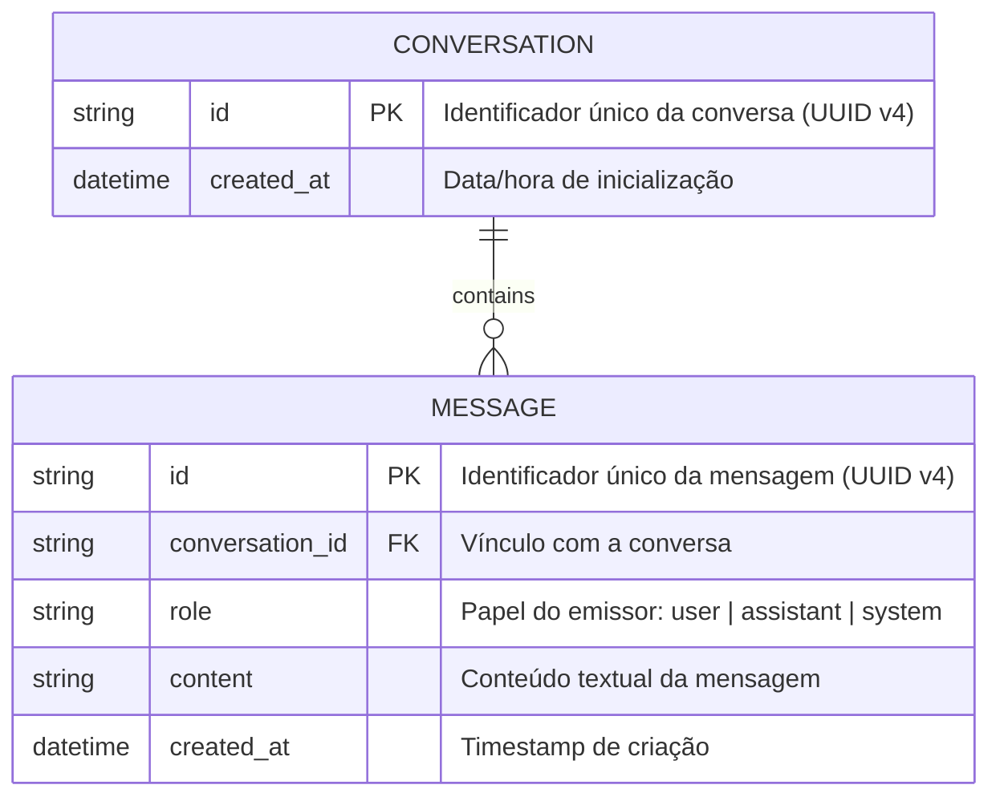
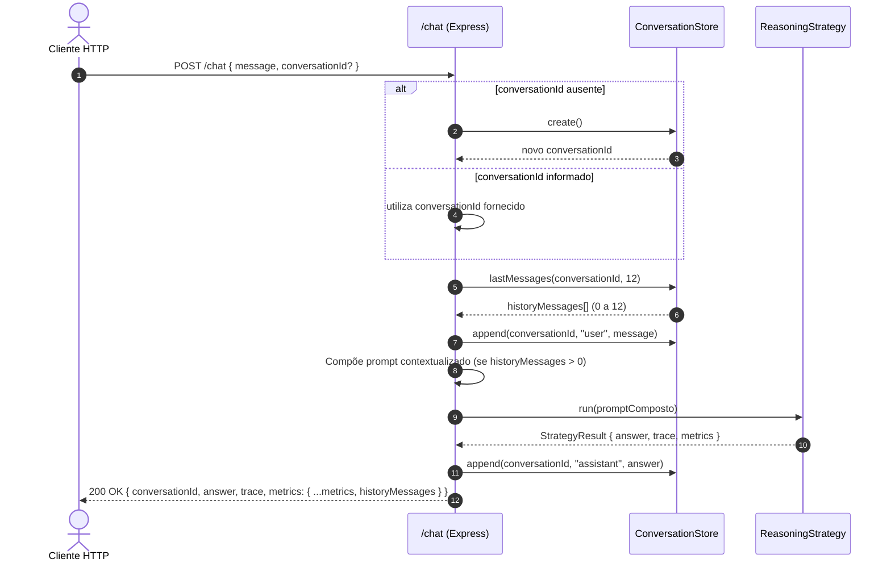

# Data Model: Conversa Persistente (`007-persistent-conversation`)

**Feature Branch**: `007-persistent-conversation`  
**Date**: 2026-10-04  
**Spec**: [spec.md](./spec.md)

---

## 1. Visão Geral das Entidades

O modelo de dados introduz a persistência do ciclo de vida das mensagens de diálogo entre o usuário/operador e a APO (Agente de Produção e Operações).



---

## 2. Esquema Relacional SQLite (DDL)

```sql
-- Tabela de histórico de mensagens
CREATE TABLE IF NOT EXISTS messages (
  id TEXT PRIMARY KEY,
  conversation_id TEXT NOT NULL,
  role TEXT NOT NULL CHECK (role IN ('user', 'assistant', 'system')),
  content TEXT NOT NULL,
  created_at DATETIME DEFAULT CURRENT_TIMESTAMP
);

-- Índice para busca rápida das últimas N mensagens de uma conversa
CREATE INDEX IF NOT EXISTS idx_messages_conversation_created 
ON messages (conversation_id, created_at ASC);
```

### Regras de Integridade:
- **Chave Primária (`id`)**: UUID v4 gerado no momento da inserção.
- **Domínio Fechado (`role`)**: Cláusula `CHECK (role IN ('user', 'assistant', 'system'))`. Qualquer outro valor é rejeitado pelo banco.
- **Integridade de Consulta**: Índice composto `(conversation_id, created_at)` garante ordenação eficiente.

---

## 3. Definições Zod e Tipos TypeScript

### 3.1. Schemas de Domínio (`src/schemas/entities.ts` ou `src/schemas/conversation.ts`)

```typescript
import { z } from "zod";

export const MessageRoleSchema = z.enum(["user", "assistant", "system"]);
export type MessageRole = z.infer<typeof MessageRoleSchema>;

export const ConversationMessageSchema = z.object({
  id: z.string().uuid(),
  conversationId: z.string().min(1),
  role: MessageRoleSchema,
  content: z.string().min(1),
  createdAt: z.string(),
});
export type ConversationMessage = z.infer<typeof ConversationMessageSchema>;
```

### 3.2. Schemas HTTP Atualizados (`src/schemas/chat.ts`)

```typescript
import { z } from "zod";

export const ChatRequestSchema = z.object({
  message: z.string().trim().min(1, "O campo 'message' não pode ser vazio"),
  strategy: z.string().trim().default("react"),
  reflect: z.boolean().default(false),
  conversationId: z.string().trim().min(1).optional(),
});
export type ChatRequest = z.infer<typeof ChatRequestSchema>;

export const ExecutionMetricsSchema = z.object({
  llmCalls: z.number().int().nonnegative(),
  latencyMs: z.number().int().nonnegative(),
  historyMessages: z.number().int().nonnegative(),
});
export type ExecutionMetrics = z.infer<typeof ExecutionMetricsSchema>;

export const ChatResponseSchema = z.object({
  conversationId: z.string().min(1),
  answer: z.string(),
  trace: z.array(TraceEventSchema),
  metrics: ExecutionMetricsSchema,
});
export type ChatResponse = z.infer<typeof ChatResponseSchema>;
```

---

## 4. Ciclo de Vida e Transições de Estado


