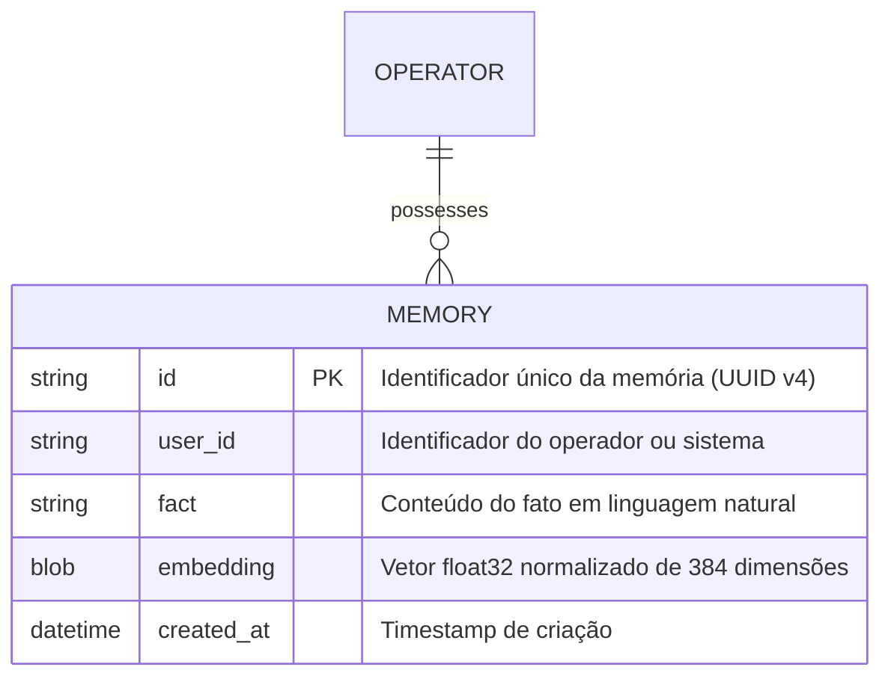

# Data Model: Memória Semântica do Operador (`008-semantic-memory`)

**Feature Branch**: `008-semantic-memory`  
**Date**: 2026-10-05  
**Spec**: [spec.md](./spec.md)

---

## 1. Visão Geral das Entidades

O modelo introduz o armazenamento relacional e vetorial de fatos operacionais associados a identificadores de usuários (`userId`).



---

## 2. Esquema Relacional SQLite (DDL)

```sql
CREATE TABLE IF NOT EXISTS memories (
  id TEXT PRIMARY KEY,
  user_id TEXT NOT NULL,
  fact TEXT NOT NULL,
  embedding BLOB NOT NULL,
  created_at DATETIME DEFAULT CURRENT_TIMESTAMP
);

CREATE INDEX IF NOT EXISTS idx_memories_user_id ON memories (user_id);
```

### Regras de Integridade:
- **`id`**: UUID v4 gerado no momento da gravação.
- **`user_id`**: Identificador não vazio do operador.
- **`fact`**: Texto não vazio do fato registrado.
- **`embedding`**: Representação binária (`Buffer` Node.js) contendo o array bruto de `Float32Array` de 384 floats (1.536 bytes).
- **`created_at`**: Data e hora de criação em UTC (ISO 8601 ou SQLite timestamp).

---

## 3. Tipos e Schemas TypeScript

### 3.1. Schemas de Memória (`src/memory/types.ts`)

```typescript
export interface MemoryRecord {
  id: string;
  userId: string;
  fact: string;
  embedding: Float32Array;
  createdAt: string;
}

export interface RememberResult {
  inserted: boolean;
  reason?: "created" | "deduplicated";
  memory: MemoryRecord;
  similarity?: number;
}

export interface RecallResult {
  id: string;
  fact: string;
  similarity: number;
}
```

### 3.2. Schema de Entrada HTTP (`src/schemas/chat.ts`)

```typescript
export const ChatRequestSchema = z.object({
  message: z.string().trim().min(1, "O campo 'message' não pode ser vazio"),
  strategy: z.string().trim().default("react"),
  reflect: z.boolean().default(false),
  conversationId: z.string().trim().min(1).optional(),
  userId: z.string().trim().min(1).optional(),
});
```

---

## 4. Fluxo de Vida e Deduplicação

```mermaid
flowchart TD
    A[remember(userId, fact)] --> B[Gera embedding com all-MiniLM-L6-v2]
    B --> C[Busca memórias existentes de userId]
    C --> D{Existe memória com similaridade > 0.92?}
    D -- Sim --> E[Deduplica: descarta inserção e retorna registro existente]
    D -- Não --> F[Insere na tabela memories como BLOB]
    F --> G[Retorna nova memória criada]
```
