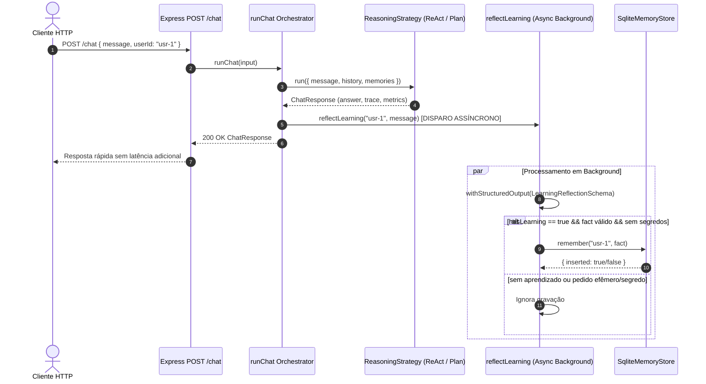
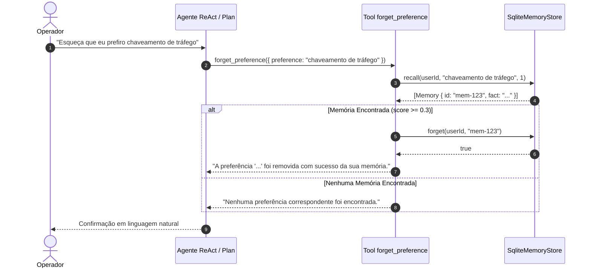

# Data Model & Contracts: Refletor de Aprendizado Contínuo (`009-learning-reflector`)

Este documento especifica os esquemas de dados, tipos TypeScript e fluxo de dados do refletor de aprendizado e da ferramenta de exclusão.

---

## 1. Esquemas Zod & Tipos

### 1.1. `LearningReflectionSchema`

```typescript
import { z } from "zod";

export const LearningReflectionSchema = z.object({
  hasLearning: z
    .boolean()
    .describe("True se a mensagem contém uma preferência durável, papel ou diretriz permanente do operador."),
  fact: z
    .string()
    .trim()
    .min(5)
    .optional()
    .describe("Fato durável formulado em terceira pessoa (ex: 'O operador prefere...')."),
});

export type LearningReflection = z.infer<typeof LearningReflectionSchema>;
```

### 1.2. `ForgetPreferenceInputSchema`

```typescript
export const ForgetPreferenceInputSchema = z.object({
  preference: z
    .string()
    .trim()
    .min(1)
    .describe("Termo ou descrição da preferência a ser esquecida."),
});

export type ForgetPreferenceInput = z.infer<typeof ForgetPreferenceInputSchema>;
```

---

## 2. Diagrama de Fluxo de Dados (Pós-Resposta)



---

## 3. Diagrama de Exclusão de Preferência via Tool (`forget_preference`)


